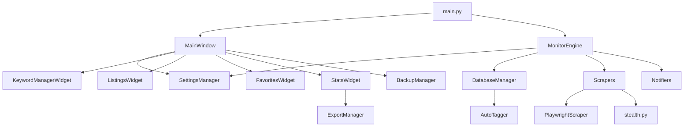

# 🤖 Claude AI 지침서 - 중고거래 알리미 (Used Market Notifier)

> **이 문서는 Claude AI가 프로젝트 코드베이스를 이해하고 효과적으로 협업하기 위한 포괄적인 가이드입니다.**

---

## 📋 프로젝트 요약

**중고거래 알리미**는 한국의 주요 중고거래 플랫폼(당근마켓, 번개장터, 중고나라)을 실시간으로 모니터링하여, 사용자가 등록한 키워드에 맞는 새 상품이 올라오면 알림을 보내는 PyQt6 기반 데스크톱 애플리케이션입니다.

### 핵심 기능 요약
| 카테고리 | 기능 |
|----------|------|
| 🔍 **검색** | 다중 플랫폼 키워드 검색, 가격/지역/제외 키워드 필터 |
| 📢 **알림** | Telegram, Discord, Slack 웹훅, 스케줄 설정 |
| 📊 **데이터** | 즐겨찾기, 가격 추적, 통계, CSV/Excel 내보내기 |
| 🏷️ **자동화** | 자동 태깅, 자동 백업, 데이터 정리 |
| 💬 **편의** | 메시지 템플릿, 매물 비교, 판매자 차단 |
| 🎨 **UI** | Catppuccin Mocha 테마, 글래스모피즘, 다크/라이트 모드 |

---

## 🏗️ 상세 아키텍처

### 모듈 의존 관계도



### 핵심 클래스 상세

#### 1. MonitorEngine (`monitor_engine.py`)

```python
class MonitorEngine:
    """핵심 모니터링 엔진
    
    책임:
    - 키워드별 주기적 스크래핑
    - 중복 체크 및 새 매물 감지
    - 가격 변동 추적
    - 알림 발송 조율
    
    콜백 시그니처:
    - on_status_update: Callable[[str], None]
    - on_new_item: Callable[[Item], None]
    - on_price_change: Callable[[Item, str, str], None]
    - on_error: Callable[[str], None]
    """
```

**핵심 메서드:**
| 메서드 | 설명 |
|--------|------|
| `initialize_scrapers()` | 공유 Playwright 드라이버로 스크래퍼 초기화 |
| `initialize_notifiers()` | 설정 기반 알림 채널 초기화 |
| `search_keyword(config)` | 단일 키워드 검색 실행 |
| `run_cycle()` | 전체 모니터링 사이클 실행 |
| `start()` / `stop()` | 비동기 모니터링 루프 제어 |
| `send_notifications(item)` | 모든 활성 채널로 알림 전송 |

#### 2. DatabaseManager (`db.py`)

```python
class DatabaseManager:
    """SQLite 데이터베이스 관리자 (Thread Safe)
    
    테이블 구조:
    - listings: 매물 정보 (platform, article_id, title, price, ...)
    - price_history: 가격 변동 이력
    - favorites: 즐겨찾기 (notes, target_price)
    - notification_logs: 알림 기록
    - seller_filters: 차단 판매자
    - tags: 자동 태깅 결과
    - search_stats: 검색 통계
    """
```

**주요 메서드:**
| 메서드 | 반환값 | 설명 |
|--------|--------|------|
| `add_listing(item)` | `(is_new, price_change, id)` | 매물 추가/업데이트 |
| `is_duplicate(platform, id)` | `bool` | 중복 체크 |
| `is_fuzzy_duplicate(item)` | `bool` | 제목 유사도 중복 체크 |
| `get_listings_paginated()` | `list[dict]` | 필터/페이지네이션 조회 |
| `add_favorite(id, notes, target)` | - | 즐겨찾기 추가 |
| `get_price_changes(days)` | `list` | 가격 변동 이력 |
| `get_daily_stats(days)` | `list` | 일별 통계 |

#### 3. AutoTagger (`auto_tagger.py`)

```python
class AutoTagger:
    """제목 분석 기반 자동 태깅 시스템
    
    기본 규칙:
    - A급: A급, 에이급, 상태좋음, 최상, S급
    - 풀박스: 풀박스, 미개봉, 새제품
    - 급처: 급처, 급매, 빨리, 오늘만
    - 네고가능: 네고가능, 네고, 협의가능
    - 택포: 택포, 택배포함, 무배
    - 직거래: 직거래, 직거래만
    - 정품: 정품, 구매영수증, 보증서
    """
```

**메서드:**
```python
analyze(title: str) -> List[str]           # 매칭 태그 이름 반환
analyze_detailed(title) -> List[TagResult] # 상세 태그 정보
format_tags_html(tags) -> str              # HTML 뱃지 렌더링
add_rule(name, keywords, color, icon)      # 규칙 추가
```

#### 4. MessageTemplateManager (`message_templates.py`)

```python
class MessageTemplateManager:
    """판매자 메시지 템플릿 시스템
    
    변수:
    - {title}: 상품 제목
    - {price}: 판매 가격
    - {seller}: 판매자 이름
    - {location}: 지역
    - {target_price}: 목표 가격
    - {platform}: 플랫폼 이름
    """
```

**기본 템플릿:**
| 이름 | 플랫폼 | 용도 |
|------|--------|------|
| 기본 문의 | 전체 | 판매 여부 확인 |
| 가격 문의 | 전체 | 네고 요청 |
| 직거래 문의 | 전체 | 직거래 가능 여부 |
| 상태 문의 | 전체 | 상세 상태 문의 |
| 당근 안부인사 | 당근마켓 | 이웃 친화적 문의 |
| 번개장터 빠른문의 | 번개장터 | 빠른 구매 의사 |

---

> 참고: 현재 앱의 기본 실행 경로는 Selenium 기반 스크래퍼를 사용합니다. Playwright 관련 코드는 옵션/개발용으로 남아있을 수 있으며, 본 문서의 일부 Playwright 중심 설명은 구현과 다를 수 있습니다.

## 📁 디렉토리별 상세 역할

### `/scrapers` - 플랫폼 스크래퍼

| 파일 | 설명 | 주요 클래스/함수 |
|------|------|------------------|
| `base.py` | 추상 베이스 | `BaseScraper` |
| `playwright_base.py` | Playwright 베이스 | `PlaywrightScraper` |
| `selenium_base.py` | Selenium 베이스 | `SeleniumBaseScraper` |
| `danggeun.py` | 당근마켓 | `DanggeunScraper` |
| `bunjang.py` | 번개장터 | `BunjangScraper` |
| `joonggonara.py` | 중고나라 | `JoonggonaraScraper` |
| `stealth.py` | 봇 탐지 우회 | `apply_full_stealth()` |
| `debug.py` | 스크래핑 디버거 | `ScraperDebugger` |

**스텔스 모듈 상세 (`stealth.py`):**
```python
# 15가지 봇 탐지 우회 기법
1. WebDriver 속성 제거
2. Chrome 객체 시뮬레이션
3. 플러그인 목록 위장
4. 언어 설정 (ko-KR, ko, en-US, en)
5. 플랫폼 위장 (Win32)
6. 하드웨어 동시성 (8 코어)
7. 디바이스 메모리 (8GB)
8. 터치 포인트 (0)
9. Permissions API 오버라이드
10. WebGL 벤더/렌더러 위장
11. Iframe contentWindow 보호
12. 콘솔 디버그 오버라이드
13. Alert/Confirm/Prompt 자동 처리
14. Canvas 핑거프린트 노이즈
15. AudioContext 핑거프린트 노이즈
```

### `/gui` - PyQt6 UI 컴포넌트

| 파일 | 설명 | 주요 클래스 |
|------|------|-------------|
| `main_window.py` | 메인 윈도우 | `MainWindow`, `MonitorThread` |
| `styles.py` | 테마 스타일시트 | `DARK_STYLE`, `LIGHT_STYLE`, `CATPPUCCIN` |
| `keyword_manager.py` | 키워드 관리 | `KeywordCard`, `KeywordEditDialog`, `KeywordManagerWidget` |
| `settings_dialog.py` | 설정 다이얼로그 | `SettingsDialog`, `NotificationTestThread` |
| `listings_widget.py` | 매물 브라우저 | `ListingsWidget` |
| `favorites_widget.py` | 즐겨찾기 | `FavoritesWidget`, `FavoritesEditDialog` |
| `stats_widget.py` | 통계 대시보드 | `StatsWidget` |
| `components.py` | 재사용 컴포넌트 | `GlassCard`, `StatCard`, `PlatformBadge`, `ToastNotification` |
| `charts.py` | 차트 위젯 | `PlatformChart`, `DailyChart` |
| `compare_dialog.py` | 매물 비교 | `CompareDialog` |
| `export_dialog.py` | 내보내기 | `ExportDialog` |
| `message_dialog.py` | 메시지 작성 | `MessageDialog` |
| `system_tray.py` | 시스템 트레이 | `SystemTrayIcon` |

**재사용 컴포넌트 상세:**
```python
# GlassCard - 글래스모피즘 카드
class GlassCard(QFrame):
    # hover 시 그림자 애니메이션
    # ObjectName: "glassCard"

# StatCard - 통계 카드
class StatCard(QFrame):
    # title, value, icon, color 지원
    # 그라디언트 배경

# PlatformBadge - 플랫폼 뱃지
class PlatformBadge(QLabel):
    # 플랫폼별 색상 + 이모지

# ToastNotification - 토스트 알림
class ToastNotification(QFrame):
    # show(message, duration) 메서드
    # 자동 페이드 아웃
```

### `/notifiers` - 알림 모듈

| 파일 | 채널 | 설정 |
|------|------|------|
| `base.py` | 추상 베이스 | - |
| `telegram_notifier.py` | Telegram | Bot Token + Chat ID |
| `discord_notifier.py` | Discord | Webhook URL |
| `slack_notifier.py` | Slack | Webhook URL |

---

## ⚠️ 수정 제약사항

### 🔴 절대 수정 금지

#### 1. 스크래퍼 파싱 로직
```python
# ❌ 절대 수정 금지
items = page.locator(".product-card")
title = item.locator(".title").text_content()
price = item.locator(".price").text_content()
```
- 플랫폼 HTML 구조에 민감하게 의존
- 잘못된 수정 시 크롤링 전체 실패

#### 2. 스텔스 기법 (`stealth.py`)
```python
# ❌ 절대 수정 금지
STEALTH_SCRIPTS = """
Object.defineProperty(navigator, 'webdriver', {
    get: () => undefined,
    ...
"""
await apply_full_stealth(context)
```
- 봇 탐지 우회를 위한 정교한 기법
- 수정 시 플랫폼 차단 위험

#### 3. DB 스키마
```sql
-- ❌ 기존 테이블 구조 변경 금지
CREATE TABLE listings (...)
CREATE TABLE price_history (...)
```
- 기존 사용자 데이터 호환성

### 🟡 주의하여 수정

| 영역 | 주의사항 |
|------|----------|
| `MonitorEngine` 비동기 흐름 | 스레드 안전성, 루프 관리 |
| PyQt 시그널 | 메인 스레드에서만 UI 업데이트 |
| JSON 직렬화 (`_to_dict`, `_from_dict`) | 기존 설정 파일 호환성 |
| 알림 메시지 포맷 | 이모지, 한글 인코딩 |

### 🟢 자유롭게 수정 가능

- UI 스타일링 (색상, 폰트, 간격)
- 새로운 통계/차트
- 설정 다이얼로그 UI
- 로그 메시지
- 문서화
- 자동 태깅 규칙 추가

---

## 🛠️ 개발 규칙

### 코딩 컨벤션

```python
# ✅ 타입 힌트 필수
def add_listing(self, item: Item) -> tuple[bool, dict | None, int]:
    """매물 추가 또는 업데이트
    
    Args:
        item: 추가할 매물 객체
        
    Returns:
        (is_new, price_change_info, listing_id)
    """
    pass

# ✅ 로깅 패턴
self.logger = logging.getLogger(self.__class__.__name__)
self.logger.info(f"새 매물 발견: {item.title}")
self.logger.error(f"크롤링 실패: {e}")

# ✅ 한글 주석 (복잡한 로직)
# 퍼지 중복 검사: 최근 24시간 내 유사 제목 확인
# difflib.SequenceMatcher 사용, threshold 0.9
```

### PyQt6 패턴

```python
# ✅ 시그널로 UI 업데이트
class MonitorThread(QThread):
    status_update = pyqtSignal(str)
    new_item = pyqtSignal(object)
    price_change = pyqtSignal(object, str, str)
    error = pyqtSignal(str)
    
    def run(self):
        # 백그라운드 작업
        self.status_update.emit("검색 중...")
        self.new_item.emit(item)

# ✅ 메인 스레드에서 UI 업데이트
@pyqtSlot(str)
def on_status_update(self, status: str):
    self.status_label.setText(status)

# ✅ ObjectName 지정 (스타일시트 적용)
button.setObjectName("primary")
card.setObjectName("glassCard")
```

### 비동기 패턴

```python
# ✅ Windows에서 asyncio 정책 설정
if sys.platform.startswith('win'):
    asyncio.set_event_loop_policy(asyncio.WindowsSelectorEventLoopPolicy())

# ✅ QThread 내 asyncio 실행
def run(self):
    self.loop = asyncio.new_event_loop()
    asyncio.set_event_loop(self.loop)
    try:
        self.loop.run_until_complete(self.engine.start())
    except Exception as e:
        self.error.emit(str(e))
    finally:
        self.loop.close()

# ✅ 재시도 데코레이터
@async_retry(max_attempts=3, delay=1.0, backoff=2.0)
async def search(self, keyword: str):
    pass
```

---

## 🎨 UI 스타일 가이드

### Catppuccin Mocha 팔레트

```python
CATPPUCCIN = {
    # 배경
    'base': '#1e1e2e',
    'mantle': '#181825',
    'crust': '#11111b',
    'surface0': '#313244',
    'surface1': '#45475a',
    'surface2': '#585b70',
    
    # 텍스트
    'text': '#cdd6f4',
    'subtext1': '#bac2de',
    'subtext0': '#a6adc8',
    'overlay2': '#9399b2',
    'overlay1': '#7f849c',
    'overlay0': '#6c7086',
    
    # 강조색
    'rosewater': '#f5e0dc',
    'flamingo': '#f2cdcd',
    'pink': '#f5c2e7',
    'mauve': '#cba6f7',
    'red': '#f38ba8',
    'maroon': '#eba0ac',
    'peach': '#fab387',
    'yellow': '#f9e2af',
    'green': '#a6e3a1',
    'teal': '#94e2d5',
    'sky': '#89dceb',
    'sapphire': '#74c7ec',
    'blue': '#89b4fa',
    'lavender': '#b4befe',
}
```

### 플랫폼별 색상

```python
PLATFORM_INFO = {
    'danggeun': {'color': '#FF6F00', 'emoji': '🥕', 'name': '당근마켓'},
    'bunjang': {'color': '#F50057', 'emoji': '⚡', 'name': '번개장터'},
    'joonggonara': {'color': '#2E7D32', 'emoji': '🛒', 'name': '중고나라'},
}
```

### 스타일시트 패턴

```css
/* 글래스모피즘 카드 */
QFrame#glassCard {
    background-color: rgba(49, 50, 68, 0.8);
    border: 1px solid rgba(137, 180, 250, 0.2);
    border-radius: 16px;
}

QFrame#glassCard:hover {
    border: 1px solid rgba(137, 180, 250, 0.4);
    background-color: rgba(49, 50, 68, 0.95);
}

/* 그라디언트 버튼 */
QPushButton {
    background: qlineargradient(x1:0, y1:0, x2:0, y2:1, 
        stop:0 #89b4fa, stop:1 #74c7ec);
    color: #1e1e2e;
    border: none;
    border-radius: 8px;
    font-weight: bold;
}
```

---

## 🧪 테스트 및 디버깅

### 스크래핑 디버그 모드

```python
# 디버그 모드 활성화
scraper = DanggeunScraper(
    headless=False,       # 브라우저 표시
    debug_mode=True,      # 디버그 활성화
    debug_level="verbose" # 상세 로그
)

# 스크린샷 저장
await scraper.take_screenshot("debug_state")

# 스텔스 검증
results = await scraper.verify_stealth()
print(results)  # webdriver: undefined, chrome: true, ...
```

### 데이터베이스 디버그

```bash
sqlite3 listings.db
```

```sql
-- 최근 매물
SELECT id, platform, title, price, created_at 
FROM listings ORDER BY created_at DESC LIMIT 10;

-- 가격 변동 내역
SELECT l.title, ph.old_price, ph.new_price, ph.changed_at
FROM price_history ph
JOIN listings l ON ph.listing_id = l.id
ORDER BY ph.changed_at DESC;

-- 플랫폼별 통계
SELECT platform, COUNT(*) as count, 
       AVG(CAST(REPLACE(REPLACE(price, ',', ''), '원', '') AS INTEGER)) as avg_price
FROM listings 
WHERE price NOT LIKE '%만원%'
GROUP BY platform;

-- 태그 분포
SELECT tag, COUNT(*) FROM tags GROUP BY tag ORDER BY COUNT(*) DESC;
```

### 로그 파일
- 위치: `notifier.log`
- 회전: 5MB, 최대 3개 백업
- 인코딩: UTF-8
- 포맷: `%(asctime)s - %(name)s - %(levelname)s - %(message)s`

---

## 📦 상수 참조 (`constants.py`)

```python
# === 타이밍 ===
SCRAPE_DELAY_SECONDS = 2           # 스크래핑 간 딜레이
DRIVER_WAIT_TIMEOUT = 10           # 요소 대기 타임아웃
DRIVER_PAGE_LOAD_TIMEOUT = 30      # 페이지 로드 타임아웃
KEYWORD_PAUSE_MS = 2000            # 키워드 간 휴식
AUTO_REFRESH_INTERVAL_MS = 60000   # 자동 새로고침 주기
SEARCH_DEBOUNCE_MS = 300           # 검색 디바운스

# === 재시도 ===
MAX_RETRY_ATTEMPTS = 3
RETRY_DELAY_SECONDS = 1.0
RETRY_BACKOFF_MULTIPLIER = 2.0

# === 페이지네이션/캐시 ===
DEFAULT_PAGE_SIZE = 50
DB_CACHE_TTL_SECONDS = 30

# === 백업/정리 ===
DEFAULT_BACKUP_DIR = "backup"
DEFAULT_BACKUP_INTERVAL_DAYS = 7
DEFAULT_BACKUP_KEEP_COUNT = 5
DEFAULT_CLEANUP_DAYS = 30

# === 태그 색상 ===
TAG_COLORS = {
    'green': '#a6e3a1',
    'blue': '#89b4fa',
    'red': '#f38ba8',
    'yellow': '#f9e2af',
    'teal': '#94e2d5',
    'purple': '#cba6f7',
    'peach': '#fab387',
    'sapphire': '#74c7ec',
}

# === 플랫폼 ===
PLATFORMS = ['danggeun', 'bunjang', 'joonggonara']
PLATFORM_NAMES = {'danggeun': '당근마켓', 'bunjang': '번개장터', 'joonggonara': '중고나라'}
PLATFORM_ICONS = {'danggeun': '🥕', 'bunjang': '⚡', 'joonggonara': '🛒'}

# === 판매 상태 ===
SALE_STATUS = {'for_sale': '판매중', 'reserved': '예약중', 'sold': '판매완료', 'unknown': '알수없음'}
```

---

## 🔧 일반적인 작업 패턴

### 새 GUI 위젯 추가

1. `gui/` 폴더에 위젯 파일 생성
2. `gui/__init__.py`에 import 추가
3. `gui/styles.py`에 스타일 추가
4. `main_window.py`에서 위젯 사용

### 새 설정 항목 추가

1. `models.py`의 `AppSettings`에 필드 추가
2. `settings_manager.py`의 `_to_dict()` 업데이트
3. `settings_manager.py`의 `_from_dict()` 업데이트 (기본값 처리)
4. `gui/settings_dialog.py`에 UI 추가

### 새 알림 채널 추가

1. `notifiers/`에 새 파일 생성
2. `BaseNotifier` 상속
3. `send_message()`, `send_item()`, `send_price_change()` 구현
4. `notifiers/__init__.py`에 export 추가
5. `monitor_engine.py`의 `initialize_notifiers()` 업데이트
6. `models.py`에 `NotificationType` 추가
7. 설정 UI 추가

### 새 자동 태깅 규칙 추가

```python
# 1. models.py에 규칙 추가 또는
# 2. auto_tagger.py의 DEFAULT_RULES에 추가

{
    "tag_name": "새 태그",
    "keywords": ["키워드1", "키워드2"],
    "color": "#89b4fa",  # Catppuccin 색상 사용
    "icon": "🏷️"
}
```

---

## 📝 자주 묻는 질문

### Q: 스크래핑이 안 될 때?
A: 
1. 네트워크 연결 확인
2. Headless 모드 비활성화 (`설정 > 일반 > 브라우저 표시`)
3. `scrapers/debug.py` 활용하여 스크린샷 저장
4. 플랫폼 HTML 구조 변경 여부 확인 (개발자 도구)
5. 스텔스 검증: `await scraper.verify_stealth()`

### Q: 알림이 안 올 때?
A:
1. `설정 > 일반 > 알림 활성화` 확인
2. 각 채널의 토큰/웹훅 URL 확인
3. "테스트" 버튼으로 연결 확인
4. 스케줄 설정 확인 (요일/시간)
5. 키워드별 `notify_enabled` 확인

### Q: UI가 느릴 때?
A:
1. DB 인덱스 확인 (`db.py`의 `create_tables()`)
2. 페이지네이션 사용 확인 (`DEFAULT_PAGE_SIZE`)
3. 캐시 TTL 조정 (`DB_CACHE_TTL_SECONDS`)
4. 대용량 테이블 정리 (`설정 > 백업/정리`)

### Q: 메모리 누수?
A:
1. `MonitorThread.stop()` 후 `wait()` 호출 확인
2. Playwright 컨텍스트 정리 (`scraper.close()`)
3. DB 연결 정리 (컨텍스트 매니저 사용)

---

## 🚨 응급 대응

### 크롤링 완전 차단 시
1. IP 변경 (VPN 사용)
2. 스텔스 모듈 업데이트 (플랫폼 변경 대응)
3. User-Agent 풀 갱신 (`stealth.py`의 `USER_AGENTS`)
4. 딜레이 증가 (`constants.py`의 `SCRAPE_DELAY_SECONDS`)

### DB 손상 시
1. `backup/` 폴더에서 최근 백업 확인
2. `BackupManager.restore_backup(file)` 실행
3. `.pre_restore` 파일로 롤백 가능

---

**이 지침을 따라 프로젝트의 안정성을 유지하면서 효과적인 지원을 제공해주세요.** 🙏
